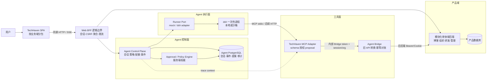

# TechHaven 架构基线

> 版本：v1.0-draft
> 日期：2026-08-29
> 状态：目标架构已提出，按 `docs/ROADMAP.md` 渐进迁移
> 适用范围：TechHaven SPA、产品后端边界、Agent Gateway、TechHaven MCP、Agent Bridge、dsh runner 与 agent 数据平面

## 1. 文档目的

本文是 TechHaven 的架构事实与目标边界的单一入口。它明确区分：

- **当前已实现**：当前仓库能静态检查或通过离线冒烟验证的能力；
- **目标架构**：后续实现应收敛到的组件职责与协议；
- **候选方案**：必须经过实验、容量或安全验证后才能采纳的选项。

详细 Agent 决策记录见 `docs/TH-RFC-001-agent-engine.md`，执行计划与退出门禁见 `docs/ROADMAP.md`。

## 2. 当前事实基线

### 2.1 已实现

- React 19 + TypeScript + Vite SPA，包含博客、社区、组织、作业、研发平台和管理后台。
- HTTP Service 层、Auth/Theme/Layout/SiteSettings/RdOrg Context、自研 UI 组件库、通知 WebSocket。
- `services/techhaven-mcp`：7 个 MCP 工具、session/org/scope 绑定 token、状态机、direct/staged 写，以及可切换的 JSONL/PG proposal repository。
- `services/techhaven-agent-bridge`：独立旧后端 adapter，负责旧认证、路径/字段/状态转换、JSONL 写幂等台账和写后读取对账；不访问产品 MySQL。
- `services/techhaven-gateway`：mock/dsh driver adapter、HTTP API、SSE 回放、权限中继、配额、看门狗，以及 JSONL/PG session-event 权威适配器。
- Agent 数据 schema v0.3、v0.2→v0.3 migration、语义层种子、loader、对账与环境门控 PG smoke。

### 2.2 尚未完成或未验证

- 前端 Agent 会话面板已实现本地 mock 与 `?driver=gateway` 双路径，并具备 SSE 事件信封消费、同页断线续传、标签页刷新后同 SID 全量回放、取消与审批调用；浏览器到本机 Gateway(mock runner) 的创建/刷新/批准/拒绝及 Gateway 强制重启自动续传已实测。它仍是 DEV 样例页，不等于真实 dsh/产品后端集成。
- MCP `bridge` 模式及独立 Bridge 已实现并可用假旧后端离线验证，但尚未用真实旧后端完成认证、路径/字段、状态机和趋势口径联调；Bridge JSONL 台账仍是单实例实现。
- dsh driver 仅按 v0.1.2-alpha.1 契约静态实现，未做 live dsh 端到端验证；该 SDK 线协议当前不能编程式应答权限，也不能取消单个在途 turn。
- PostgreSQL 权威代码已实现，但本机无可用实例；DDL、迁移、loader、并发与恢复尚未取得 live PostgreSQL 证据。
- 根前端构建、Vitest 安全/认证回归、路由分包与四 job CI 已建立；干净 checkout 的 CI 结果仍是发布门禁的一部分。

因此，当前 Agent 能力的准确成熟度是：**离线 PoC 闭环通过，真实集成尚未完成**。

## 3. 架构原则

1. **域数据只有一个权威来源**：需求、缺陷、任务、用户和组织仍归产品后端；Agent 平面只引用业务 ID。
2. **协议是边界**：SPA 不感知 dsh；dsh 不持有产品服务凭据；MCP 不直接访问产品数据库。
3. **模块化单体优先**：在团队、吞吐或部署独立性没有证据前，不把产品域后端拆成微服务。
4. **Ports & Adapters**：业务状态机、审批策略和配额规则不得依赖 HTTP、MCP、PostgreSQL、JSONL 或具体 runner。
5. **控制面与执行面分离**：控制面决定身份、策略、配额、审批和审计；执行面只运行受约束的 agent 会话。
6. **服务端强制，客户端提示**：MCP annotations、UI 徽标和模型提示只提供信息，不能替代服务端授权和状态机校验。
7. **失败关闭**：身份、组织、scope、审批状态或事件顺序不确定时拒绝写入，不做猜测性恢复。
8. **渐进替换**：使用 adapter、feature flag 和双写校验迁移，不进行大爆炸式重写。
9. **先可观测再扩容**：没有 trace、指标、审计和基线，就不进入多租户或云沙箱阶段。
10. **文档声明必须可验证**：只有自动化或真实环境证据支持的能力才能标记“完成”。

## 4. 目标架构



### 4.1 SPA

- 以路由域拆分 `home/article/organization/rd/admin/agent`，通过 `React.lazy` + `Suspense` 延迟加载。
- 浏览器只与同源 BFF/反向代理交互；不持有产品后端服务凭据、Gateway 管理 token 或 MCP agent token。
- HTML/SVG 渲染属于安全边界；Mermaid 等第三方渲染必须使用严格配置并对最终输出做安全验证。
- `src/services` 逐步改为按域暴露 typed client，禁止页面拼接后端 URL 或复制错误码逻辑。

### 4.2 Web BFF 逻辑边界

TechHaven 当前只有一个 Web SPA，不建议立即新建独立 BFF 部署单元。先在现有产品后端或同源反向代理中形成逻辑边界：

- 终止浏览器会话，使用 `HttpOnly + Secure + SameSite` Cookie，并落实 CSRF 防护；
- 聚合首页、研发看板和 Agent 会话所需数据，避免 SPA 扇出调用；
- 对外隐藏域服务和 Agent Control Plane 的内部地址；
- 统一请求 ID、限流、超时、错误契约和 trace context；
- 不承载工单状态机、审批策略等域业务逻辑。

只有出现第二类差异显著的客户端、独立发布节奏或容量隔离需求时，才评估把逻辑 BFF 拆成独立服务。

### 4.3 产品域后端

- 保持模块化单体：博客、组织、研发、管理各自拥有清晰模块接口和数据所有权。
- 工单状态机只在域后端定义和执行；前端、MCP 和 Gateway 通过契约引用，不能复制一份独立真相。
- 对 Agent 暴露版本化内部 API；写接口必须支持幂等键、操作者、原因和审计关联 ID。

### 4.4 Agent Control Plane

`techhaven-gateway` 的目标职责是控制面而不是第二个业务后端：

- 会话创建、取消、状态推进和恢复；
- runner adapter 生命周期；
- 组织级配额、工具策略和审批编排；
- 通过 `ProposalPort` 查询/决定 MCP 权威 proposal，并将生命周期投影到 session SSE；
- runner 与 proposal 统一 SSE 事件回放、顺序保证和慢客户端保护；
- trace、metrics、结构化日志与审计关联。

它不得直接修改工单状态、持有前端用户密码或解释产品域状态机。

### 4.5 Approval / Policy Engine

当前 dsh SDK 无法编程式回答其内部权限请求，因此 TechHaven 写权限不能以 dsh 事件为权威。目标流程是：

1. MCP 收到写调用，校验 session/org/scope、工具策略、输入 schema 和域预条件；
2. 需要审批时创建持久化 proposal，返回 `pending`，不执行写入；
3. 用户在 TechHaven UI 对 proposal 批准或拒绝；
4. 服务端 worker 在批准后重新读取域状态、重新校验状态机并幂等执行；
5. 执行结果经 Gateway proposal adapter 投影为 `proposal_lifecycle` 事件并通知 SPA；模型轮询只能查询状态，不能成为“触发应用”的唯一机制。

runner `permission_request` 只表示外部执行引擎自身的工具权限；产品写入授权由 proposal 状态机独立掌权。两者共享 session 事件序列，但不得合并成同一个审批状态。

dsh 内部文件、命令等执行权限若无法可靠应答，runner profile 必须 fail-closed；不得在 UI 中展示“批准成功”但引擎实际没有收到决定。

### 4.6 TechHaven MCP

MCP 是产品域的 anti-corruption layer 和工具 adapter：

- 输入/输出使用 JSON Schema，返回稳定的结构化错误码；
- 每个工具声明 read-only、destructive、idempotent、open-world 等 annotations，但服务端策略独立判断；
- inbound agent token 绑定 `audience + sid + org + scopes + exp + jti`；
- inbound token 不透传给产品域 API，产品服务凭据独立签发、轮换和审计；
- 所有写工具要求幂等键；高风险工具默认 staged；
- MCP stdio 继续从环境接收凭据；未来若开放 HTTP transport，再按 MCP OAuth 规范实现资源指示与 audience 校验。

### 4.7 Agent Bridge

当既有产品后端不能改造时，`techhaven-agent-bridge` 作为独立部署的 anti-corruption layer：

- MCP 只调用稳定的 `/internal/v1/*` 契约，不理解旧 `/rd/*` 路径、`errno/data`、Cookie 或数字状态；
- Bridge 使用独立旧后端凭据，通过 HTTP 调用产品域；不透传 agent token，不直连 MySQL；
- 写请求带 `Idempotency-Key` 和 `expectedFromStatus`，Bridge 按“写前读 → 台账 started → 单次写 → 写后读”确认结果；超时/5xx 后先读取对账，无法确认则标记 uncertain 并停止盲重试；
- 当前 Bridge 静态 token 信任调用它的 MCP 对 session/org 的校验。跨信任域或多副本部署前，需升级为短期 audience/org 服务身份以及数据库唯一约束/事务锁；
- 当前趋势是每类最多 200 条列表的近似聚合；产品域提供权威聚合 API 后应替换 adapter。

该层是旧后端迁移适配，不改变产品域的数据权威；旧后端仍负责最终业务权限和 MySQL 写入。

### 4.8 Runner Plane

- `EngineDriver` 是端口，mock 与 dsh 是 adapter；产品代码不得 import dsh 内部类型。
- 本地 runner 仅用于受信任的开发者试点；多租户生产必须使用每会话一次性沙箱、最小挂载、网络出站 allowlist 和资源上限。
- runner 版本、profile、模型和工具目录由 Control Plane 下发并记录，前端不能任意指定。
- 一个 runner 故障不得耗尽其他组织的会话容量；按组织或执行池应用 bulkhead。

## 5. 数据与事件

### 5.1 权威存储迁移

当前 JSONL 适合离线 PoC 和故障取证，但不适合作为多进程审批与生产查询的权威存储。目标状态：

- PostgreSQL：authoritative 模式下 `agent_sessions`、`agent_events`、`agent_write_proposals` 的权威来源；`agent_tool_calls` 仍处于镜像迁移阶段；
- JSONL：本地 write-ahead spool、调试导出和数据库暂时不可用时的有限缓冲；
- 数据库恢复后通过幂等装载补写，按 `sid + seq`、`proposal_ref`、`call_id` 去重；
- 迁移期执行双写比对，但不允许两个方向同时接受写入。

当前实现的 fail-closed 约束：Gateway 事件在 PG 提交后才进入内存/SSE，组织配额由 advisory transaction lock 串行化；MCP proposal 在事务行锁内完成批准与 worker 应用。JSONL 兼容模式仍用于离线 mock，不等于多实例保证。

Bridge 的 `bridge-operations.jsonl` 是另一份独立的写入幂等证据，不是业务数据源；当前只允许单 Bridge 实例。它不能与 Gateway/MCP JSONL 合并，也不能替代产品 MySQL 或 Agent PostgreSQL。

### 5.2 事件信封

跨 Control Plane、MCP、BFF 和前端的事件统一使用版本化信封：

```json
{
  "schemaVersion": 1,
  "eventId": "evt_...",
  "sessionId": "ses_...",
  "orgId": 1,
  "seq": 42,
  "type": "tool_call",
  "occurredAt": "2026-08-29T08:00:00.000Z",
  "traceId": "...",
  "payload": {}
}
```

约束：

- `seq` 在会话内严格递增，数据库唯一约束防重；
- SSE `Last-Event-ID` 与 `seq` 对齐；客户端在信任边界校验 EventEnvelope，并按 `sid + seq` 幂等消费；
- PoC 单实例重启从 JSONL 重建历史事件；终态延续剩余 TTL，无法恢复 runner 句柄的活动会话明确追加 failed，原始 prompt 不落日志并以占位文本返回；
- payload 只新增可选字段；破坏性变更提升 `schemaVersion`；
- token、完整 prompt、密钥和不必要的个人数据不得进入事件或日志。

## 6. 安全基线

| 边界                   | 必须落实                                                                        |
| ---------------------- | ------------------------------------------------------------------------------- |
| Browser → BFF          | HTTPS/WSS、HttpOnly Cookie、SameSite、CSRF、Origin allowlist、CSP、输入大小限制 |
| BFF → Control Plane    | 内部 audience token 或 mTLS、短 TTL、请求 ID、最小 scope                        |
| Control Plane → Runner | 一次性会话凭据、最小环境变量、工具 allowlist、资源/网络限制                     |
| Runner → MCP           | session/org/audience 绑定 token、禁止 token passthrough、审计摘要               |
| MCP → Bridge           | 独立内部 Bearer、session/org 头、超时、不得透传 agent token                     |
| Bridge → Domain API    | 独立旧后端 Bearer/Cookie、状态映射、写前置条件、幂等台账与写后对账              |
| 用户内容渲染           | 禁止未净化 `innerHTML`；Mermaid/SVG 严格模式；链接协议 allowlist                |

WebSocket/SSE 还需：握手 Origin 校验、消息 schema、每消息授权、最大消息体、连接/消息限流、心跳、退出登录立即关闭连接、日志中清除 token。

安全验收清单以 OWASP ASVS 5 为基线；具体 assurance level 在生产试点前由威胁模型确定。

## 7. 可靠性与可观测性

### 7.1 可靠性模式

- 远程依赖设置明确 timeout；只对可判定的瞬时错误做有限重试并加入 jitter。
- 非幂等写在没有幂等键时禁止自动重试。
- Gateway、MCP、Bridge 和 BFF 不得层层重复重试；Bridge 对无法判定是否已提交的旧写入只对账、不盲重试。每条调用链指定唯一重试责任方和 retry budget。
- 对持续失败的 dsh、域 API 或 PostgreSQL 使用 circuit breaker；对组织/执行池使用 bulkhead。
- readiness 必须检查关键依赖，liveness 只检查进程；降级路径必须可观察且有时限。

### 7.2 OpenTelemetry 信号

统一传播 W3C trace context，并至少记录：

- spans：`agent.session.create`、`agent.runner.start`、`agent.tool.call`、`agent.proposal.apply`、域 API client；
- metrics：活动会话、排队时间、运行时长、工具成功率、审批等待、SSE 重连、事件积压、配额拒绝、token 拒绝；
- logs：结构化日志带 `trace_id/session_id/org_id/tool/call_id`，不带 token、完整参数或敏感正文；
- audit：与运行日志分离、append-only、可按 proposal/call/session 关联。

候选 SLO 必须先采集基线再冻结。初始验证目标：事件持久化后回放不丢序、越权写成功数为 0、所有写调用可关联到用户决定或策略决定。

## 8. 测试与发布架构

测试按边界分层：

1. **纯域测试**：状态机、scope、策略、配额、事件折叠，不启动网络或数据库；
2. **contract test**：SPA↔BFF、BFF↔Gateway、MCP↔Bridge、Bridge↔旧域 API、driver↔dsh 契约；
3. **adapter integration**：PostgreSQL、JSONL spool、SSE 回放、HTTP client；
4. **端到端**：mock 必跑；真实 dsh + 测试后端作为受控 nightly/release gate；
5. **安全测试**：跨组织、token audience、重放、CSWSH、恶意 Mermaid、审批竞态；
6. **恢复测试**：进程重启、数据库短暂不可用、断线续传、重复事件和重复批准。

CI 至少包含三个独立 job：root SPA、techhaven-mcp、techhaven-gateway。发布必须经过构建、类型、测试、冒烟、依赖审计、产物体积预算和文档状态检查。

## 9. 明确不采用

- 当前阶段不拆产品域微服务；
- 不 fork 或进程内嵌入 dsh；
- 不让 agent 通过 UI 自动化操作已有产品 API 能完成的工作；
- 不把浏览器用户 token 传给 runner/MCP；
- 不以 MCP annotations 或模型自述代替授权；
- 不把 mock 冒烟、静态 SQL 核对或 Vite 单独打包称为生产验证；
- 不在没有真实指标前引入 Kafka、服务网格或多区域部署。

## 10. 采用来源

- Ports & Adapters：Alistair Cockburn 原始文章，https://alistair.cockburn.us/hexagonal-architecture
- BFF：Microsoft Azure Architecture Center，https://learn.microsoft.com/en-us/azure/architecture/patterns/backends-for-frontends
- Gatekeeper：Microsoft Azure Architecture Center，https://learn.microsoft.com/en-us/azure/architecture/patterns/gatekeeper
- Circuit Breaker：Microsoft Azure Architecture Center，https://learn.microsoft.com/en-us/azure/architecture/patterns/circuit-breaker
- React lazy：React 官方文档，https://react.dev/reference/react/lazy
- MCP Authorization（2025-11-25）：https://modelcontextprotocol.io/specification/2025-11-25/basic/authorization
- MCP Tool Schema/Annotations：https://modelcontextprotocol.io/specification/2025-11-25/schema
- MCP Tasks（实验性，当前不采纳为核心依赖）：https://modelcontextprotocol.io/specification/2025-11-25/basic/utilities/tasks
- OpenTelemetry semantic conventions：https://opentelemetry.io/docs/specs/semconv/general/
- OWASP WebSocket Security：https://cheatsheetseries.owasp.org/cheatsheets/WebSocket_Security_Cheat_Sheet.html
- OWASP XSS Prevention：https://cheatsheetseries.owasp.org/cheatsheets/Cross_Site_Scripting_Prevention_Cheat_Sheet.html
- OWASP ASVS：https://owasp.org/www-project-application-security-verification-standard/
- Branch by Abstraction：https://www.martinfowler.com/bliki/BranchByAbstraction.html
